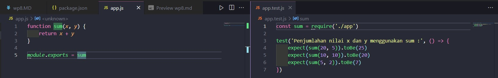
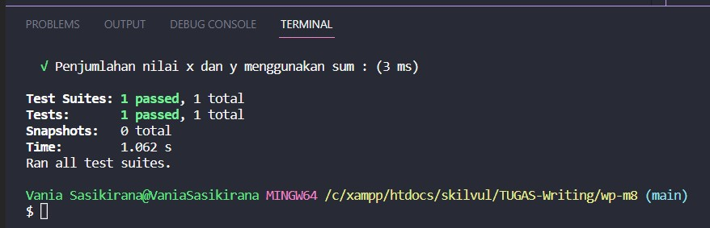
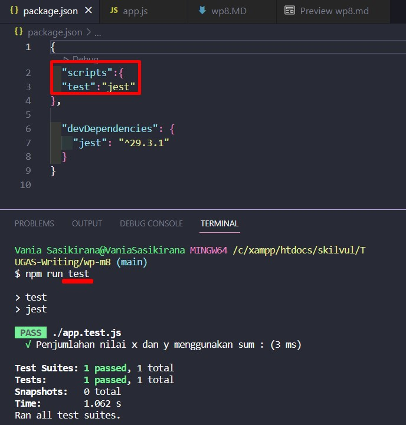

# Writing and Presentation Test Week 8 [7 nov s/d 11 nov]
## <h4>Nama     : Vania Sasikirana</h4><h4></h4>Group FE 2 - Kelompok 11</h4> <h4>Mentor : Thoriq Nur Faizal</h4>

<br>
<br>


### **1. React Context**
<br><b>React Context</b><hr>
  
React context disini berfungsi jika kita hendak membuat sebuah komponen context, nah componen context ini akan memProvide ke seluruh component yang kita miliki. Sehingga saat komponennya membutuhkan state, kita tinggal mengambilnya dari component contextnya ( jadi kita gaperlu membuat store segala macem).<br><br>
<b>useContext Hook : </b>
<br>

```
    import { useState, createContext, useContext} from "react"
    import ReactDOM from "react-dom/client"

    const UserContext = createContext();

    function Component1() {
    const [user, setUser] = useState("Jesse Hall");

    return (
        <UserContext.Provider value={user}>
        <h1>{`Welcomeback ${user}!`}</h1>
        </UserContext.Provider>
    );
    }
```

Pada React-context seluruh component yang dibungkus oleh context ini akan menjadi child/children.

```

    import React, { createContext, useContext} from "react"

    export const NontonCountContext = createContext();

        function NontonCountProvider({children}) {
        const [NontonCount, setNontonCount] = useState(0);

        return (
            <NontonCountContext.Provider value={NontonCount, setNontonCount}>
                {children}
            </NontonCountContext.Provider>
        );
        }
```

### **2. Unit Testing**
<br><b>Unit Testing</b><hr>
  
Unit Testing ini dibuat untuk menguji benar/salahnya kode yang kita buat, nah dalam unit testing ini kita harus mengetahui hasil dari resultnya apakah sudah passed atau failed.<br><br>
<b>Contoh permasalahan : </b>
- Jika kita ingin hasil dari penjumlahan nilai antara a = 20 dan b = 5 adalah 25
- Jika kita ingin hasil dari penjumlahan nilai antara a = 10 dan b = 10 adalah 20
- Jika kita ingin hasil dari penjumlahan nilai antara a = 5 dan b = 2 adalah 7
<br>
<br>
Maka skenario di atas dapat kita ubah menjadi unit Testing seperti :<br>
<br>
<br><br>

Sehingga hasil dari unit testingnya adalah passed :<br>
<br><br>

Sebelum melakukan testing jangan lupa install "jest" terlebih dahulu.<br>

<h4><b>Jest : </b> Merupakan library untuk melakukan pengujian pada bahasa pemrograman Javascript, untuk penginstallannya 
cukup ketikkan  "npm install --save-dev jest" tanpa tanda petik. Agar kita dapat merunning file testing kita.<br><br>
Setelah proses instalasi selesai kita tambahkan Scripts Test seperti gambar di bawah ini :<br>

<br><br>
